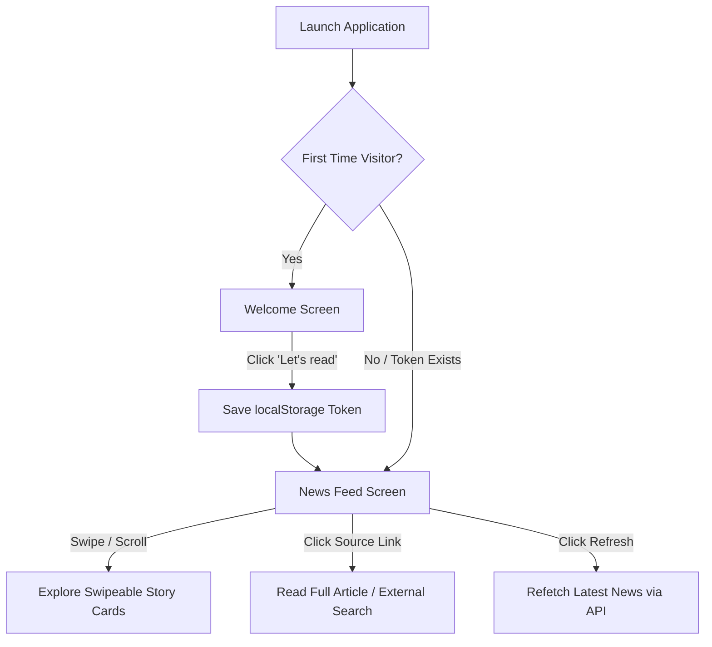
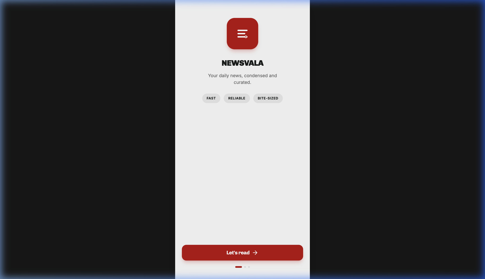
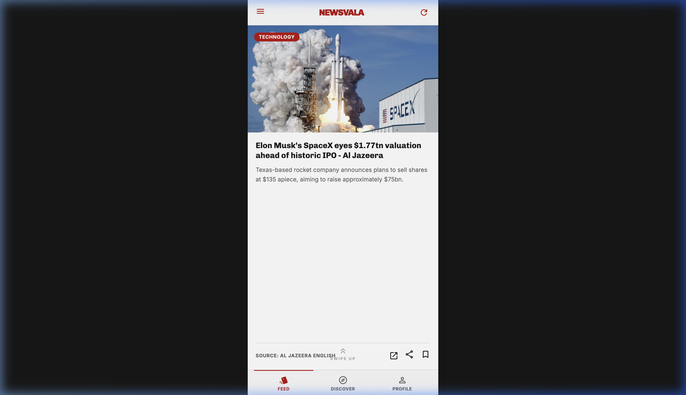

# 📰 Newsvala — Stay Informed

Newsvala is a modern, high-fidelity web application that delivers condensed, curated news in a sleek, swipeable, mobile-first interface. Designed to keep readers informed quickly and effortlessly, it provides bite-sized summaries of the latest tech, business, and breaking news.

---

## 🚀 Key Features

- **⚡ Fast & Bite-sized**: News summarized into clean, digestible paragraphs that fit on a single screen.
- **📱 Mobile-First Design**: Optimized layout featuring an interactive swipeable/snap-scroll feed designed for easy single-hand navigation.
- **🏷️ Categories**: Highlighted classification labels (e.g., Tech, Critical, General) for quick visual scanning.
- **🔗 Direct Sources**: Read the full original article via external links.
- **🔖 Reading Tools**: Bookmark favorite stories for later or share them on social platforms.
- **🔄 Local Storage Navigation Lock**: Detects first-time visitors and routes them through an introductory Welcome flow.

---

## 🛠️ Tech Stack

- **Framework**: [React 19](https://react.dev/) + [Vite](https://vitejs.dev/) + [TypeScript](https://www.typescriptlang.org/)
- **Routing**: [TanStack Router v1](https://tanstack.com/router/latest) (file-based routing)
- **State & Data Fetching**: [TanStack Query v5](https://tanstack.com/query/latest)
- **Styling**: [TailwindCSS v4](https://tailwindcss.com/)
- **UI Components**: [Radix UI](https://www.radix-ui.com/) + [Lucide React Icons](https://lucide.dev/)

---

## 🔄 Application Flow

The app guides users through a structured navigation path, ensuring a seamless user experience:



### 1. Welcome Screen
When a user launches the app for the first time, they are greeted by an immersive, dark-themed onboarding screen.
- **Local Storage Lock**: The app checks for a `newsvala:welcomed` item in `localStorage`. If absent, it automatically redirects the user to `/welcome`.
- **Primary CTA**: Clicking **"Let's read"** flags the local storage token and navigates the user to the main feed.



### 2. News Feed Screen
The heart of the application, featuring a highly-polished news reader mimicking an interactive feed format.
- **Swipe / Snap Scrolling**: Cards snap vertically as you scroll, presenting one news story at a time.
- **Visual Category Labels**: Dynamic colored badges classifying news categories.
- **Interactive Metadata**: Shows the source of the story and includes actions to:
  - Open the full article in a new tab (`open_in_new`).
  - Share the story (`share`).
  - Bookmark it for later (`bookmark`, toggles highlight state).
- **Navigation Layout**:
  - **Top Bar**: Displays the brand header and a manual refresh trigger.
  - **Bottom Navigation**: Quick links for **Feed**, **Discover**, and **Profile**.
  - **Swipe Hint**: A clean micro-animation directing users on how to navigate the feed.



---

## 💻 Local Setup & Installation

To run this project locally, ensure you have **Node.js** and **npm** installed, then follow these steps:

### 1. Install Dependencies
```bash
npm install
```

### 2. Configure Environment Variables
Create a `.env` file in the root directory:
```env
NEWS_API_KEY=your_news_api_key_here
```

### 3. Start Development Server
```bash
npm run dev
```
The server will start, typically running on **`http://localhost:8080/`**.

### 4. Build for Production
```bash
npm run build
```
